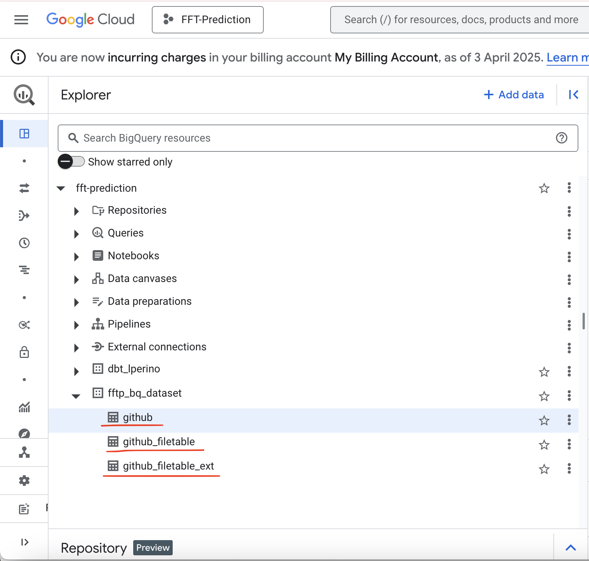

# Github activities visualization
This is my submission for [Data Engineering Zoomcamp 2025](https://github.com/DataTalksClub/data-engineering-zoomcamp) final project.

## Problem Statement
[GH Archive](https://www.gharchive.org/) is a project to record the public GitHub timeline, archive it, and make it easily accessible for further analysis. In this project I have created a pipeline to analyse Github activites data between `Jan 2015` and `Dec 2015` to answer the following questions:

- How do github events (Push, PullRequest, IssuesRequest, etc.) vary over time?
- Which github events are most recurrent?
- Which github repos have been the most active? Which github events contributed the most?

## Data

This data used in this project is extracted from [GH Archive](https://www.gharchive.org/).

The data includes the following fields:
- id
- public
- repo
- payload
- actor
- org
- created_at
- type

## Tech Stack

- **Docker** (containerization)
- **Terraform** (infrastructure as code)
- **Kestra** (workflow orchestration)
- **Google Cloud Storage** (data lake)
- **BigQuery** (data warehouse)
- **dbt** (data transformation)
- **Looker Studio** (data visualization)

## Data pipeline


## Data visualization

  
## Installation and Execution

### 0) Prerequites

Make sure the following softwares have been installed on your local machine:
- [TerraForm](https://developer.hashicorp.com/terraform/tutorials/aws-get-started/install-cli#install-terraform)
- [Docker Desktop](https://www.docker.com/get-started/)

### 1) Git clone

Clone this repo on your local machine:
```shell
git clone https://github.com/LolloPero/Github-activities-visualization.git
```

### 2) Google Cloud & Terraform : setup cloud infrastructure

For this project it is necessary to setup the following Cloud Resources:
- Data Lake
- Data Warehouse

The resources above are set up with Google Cloud. Terraform is used in combination with Google Cloud to make the deployment reproducible.

Follow these steps:
 
  1.1) Create an account on [Google Cloud Platform](https://cloud.google.com/cloud-console?utm_source=google&utm_medium=cpc&utm_campaign=emea-fi-all-en-dr-bkws-all-all-trial-e-gcp-1707574&utm_content=text-ad-none-any-DEV_c-CRE_677761787511-ADGP_Hybrid+%7C+BKWS+-+MIX+%7C+Txt+-+Management+Developer+Tools+-+Cloud+Console-KWID_43700078355835721-kwd-55675752867-userloc_9072483&utm_term=KW_google+cloud+console-NET_g-PLAC_&&gad_source=1&gclid=EAIaIQobChMI9fbUzamWjAMVX0KRBR39aS0LEAAYASAAEgIt-_D_BwE&gclsrc=aw.ds&hl=en) with your Google email ID

  1.2) Setup your first [project](https://console.cloud.google.com/) if you haven't already
  * eg. "Github-activity-analysis", and note down the "Project ID" (we'll use this later when deploying cloud resources with TerraForm)

  1.3) Setup a Google Cloud Service Account: ([Video](https://www.youtube.com/watch?v=Y2ux7gq3Z0o&list=PL3MmuxUbc_hJed7dXYoJw8DoCuVHhGEQb&index=12))
  * 1.3.1) Create a Service Account with the following Roles:
       - Storage Admin
       - BigQuery Admin
       - Compute Admin
  * 1.3.2) Download service-account-keys (.json) for auth, and store it under `code/terraform/keys`
  * 1.3.3) Setup environment variable to enable authentication:
     ```shell
     export GOOGLE_APPLICATION_CREDENTIALS="<path/to/your/service-account-authkeys>.json"
     ```

   1.4) Edit the [variables.tf](https://github.com/LolloPero/Fraudulent-Financial-Transaction-Prediction/blob/main/code/terraform/variables.tf) file with your
   * [project_id](https://github.com/LolloPero/Fraudulent-Financial-Transaction-Prediction/blob/main/code/terraform/variables.tf#L11), look it up on your Google CLoud Console UI
   * [bucket name](https://github.com/LolloPero/Fraudulent-Financial-Transaction-Prediction/blob/main/code/terraform/variables.tf#L35), e.g., **github_data**
   * [BigQuery dataset name](https://github.com/LolloPero/Fraudulent-Financial-Transaction-Prediction/blob/main/code/terraform/variables.tf#L29) e.g., **github_bq_dataset**
  
   1.5) Execute terraform commands:
```shell
   cd code/terraform
   terraform init
   terraform plan
   terraform apply
```


### 3) Kestra

Kestra is used in this project to automate the upload of data to a Data Lake (Google Cloud Bucket) and Data Warehouse (Google BigQuery).

To execute the Kestra pipeline, follow these steps:

2.1) Spin docker containers - this will launch Kestra Application and its dependencies:

  ```shell
  cd code/kestra
  docker-compose up
  ```

 2.2) Setup key-value pairs in Kestra UI to register your Cloud resources (created at step 2)
 * connect to Kestra by entering *http://localhost:8080/* in your web browser of choice
 * from the Kestra Home Page, navigate to *Namespaces* -> *zoomcamp* -> *KV Store*
 * Store the following Key-Value pairs as follows:
    * *GCP_CREDS* : store json file to access your Google Cloud Project (see point 1.3.2)
    * *GCP_BUCKET_NAME* :  your google cloud bucket id
    * *GCP_PROJECT_ID* : your google cloud project id
    * *GCP_LOCATION* : your google cloud project location (EU, US..)
    * *GCP_DATASET* : your google cloud bigquery dataset name  


   
   
 2.3) Uplaod kestra flow to kestra service:
 
  ```shell
    cd code/kestra/flows
    curl -X POST http://localhost:8080/api/v1/flows/import -F fileUpload=@github_activities_ingestion.yaml
  ```

 2.4) Manually trigger backfill Flow execution from Kestra UI:
 * Navigate to _Flows_ -> _github_activities_ingestion_ -> Triggers -> _Backfill executions_
 * Entert the **Start** date as _2015-01-01 00:00:00_ and the **End** date as _2015-12-31 00:00:00_
 * Click on _Execute backfill_


   

 2.5) If your Kestra backfill workflow is successful (it will take ~15 mins to complete), you should see .json files uploaded in your Google Cloud Bucket, and Tables created in your Google Cloud Query instance.

 _Json Files uploaded_
 

_BigQuery Tables_
 

### 4) DBT

#### Create a dbt cloud project
Create a dbt user account by going to [dbt homepage](https://www.getdbt.com/) and signing up for a free account.

Non-enterprise account can have only one project. Navigate to _Account_ > _Projects_ to delete any old project. Now we can go to the homepage to setup a new project.

 

Choose **BigQuery** as the data warehouse.

* Upload the service account key json file in the create from file option. This will fill out most fields related to the production credentials.
* Scroll down to the end of the page and set up the development credentials.
* Click on **Test Connection** > **Next**.
* Finally, add this GitHub repository by selecting the *Git Clone* option. Navigate to **Account** > **Projects** to specify the project subdirectory which is _code/dbt_.


Navigate to **Develop** tab on the top to view the project.

dbt does not allow us to work on the main branch after this, hence we need to create a new branch.

#### Build the dbt project

Go to the file `code\dbt\models\staging\schema.yml` in the dbt console
- Change `database` to your BigQuery dataset name
- Change `schema` to your BigQuery schema name
- Save changes

If we click on the **Lineage** tab in the bottom, we should see this diagram:


To build the project run:
```bash
dbt build
```


dbt docs can be generated on the cloud or locally with `dbt docs generate`, and can be hosted in dbt Cloud as well or on any other webserver by running `dbt docs serve`

Now, if we navigate to BigQuery we will be able to see the tables created by dbt.


To test if the data has been correctly uploaded, run the following SQL code:
```sql
select count(*)
from `<your_BQ_dataset>.<your_BQ_schema>.eventsS_repositoryA_userC`;
```
It should return `**`


### 5) Visualize with Looker Studio

Navigate to [Google Looker Studio](https://lookerstudio.google.com/). 

Click on **Create** > **Data source** > **BigQuery** > authorize BigQuery > select the Project (`github`) > Dataset (`github_activities`) > Table (`eventsS_repositoryA_userC`) > **CONNECT**.


Click on **CREATE REPORT** > **ADD TO REPORT**.

Rename the report as **Github activity Analysis**.

#### Github count activities by type over time

1. **Add a chart** > **Stacked column chart**
2. _Dimension_ = `event_date`,
3. _Breakdown dimension_ = `event_type`
4.  _Metric_ = `record_count`


#### Github event types percentage

1. **Add a chart** > **Pie chart**
2. _Date range dimension_ = `event_date`
3. _Dimension_ = `event_type`
4. _Metric_ = `Record Count`

#### Repos activity count by type


1. **Add a chart** > **Bar chart**
2. _Dimension_ = `repo_name`
3. _Breakdown dimension_ = `event_type`
4. Metric = `event_count`
